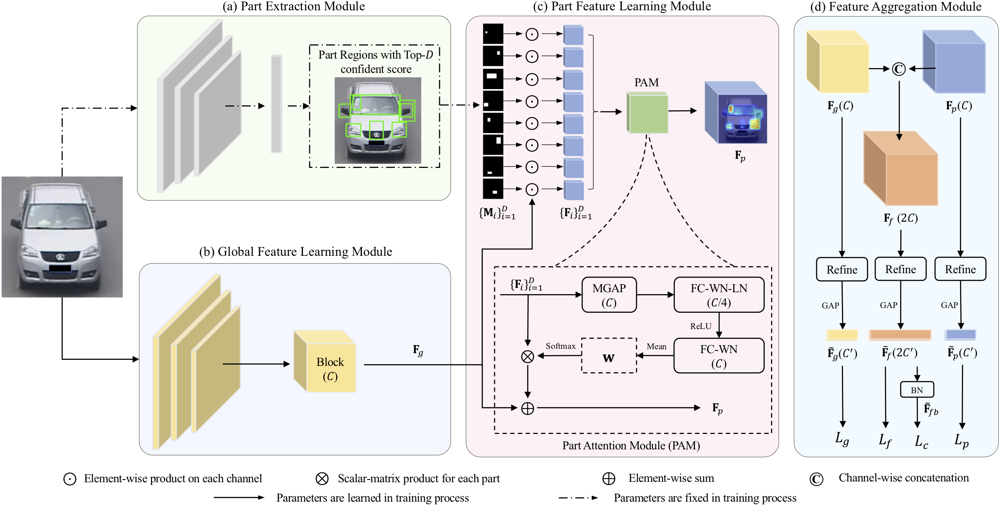

# PGAN

This code is for the paper Part-Guided Attention Learning for Vehicle Instance Retrieval. (TITS2020)

[[PDF]](https://ieeexplore.ieee.org/document/9244142)
[[Arxiv]](https://arxiv.org/abs/1909.06023v4)
[[Project]](https://github.com/zhangxinyu-xyz/PGAN-VehicleRe-ID-self/)

**This code is ONLY** released for academic use.

## Model Structure
<div align=center>

</div>

## Installation

- Python 3.6.5 
- Pytorch 1.0.0 
- Torchvision 0.2.1
- scipy 1.2.0
- pytorch-ignite 0.2.0
- Please refer to `requirements.txt` for the other packages with the corresponding versions.

## Preparation
1. Run `git clone https://github.com/zhangxinyu-xyz/PGAN-VehicleRe-ID-self.git`
2. Prepare dataset

    a. Download datasets: [VeRi](https://github.com/JDAI-CV/VeRidataset), [PKU-VehicleID](https://pkuml.org/resources/pku-vehicleid.html), [VRIC](https://qmul-vric.github.io/), [VERI-Wild](https://github.com/PKU-IMRE/VERI-Wild). Move them to ```$PGAN/vehicle_data/```.

    b. Download masks of part regions: [VeRi](https://github.com/JDAI-CV/VeRidataset), [PKU-VehicleID](https://pkuml.org/resources/pku-vehicleid.html), [VRIC](https://qmul-vric.github.io/), [VERI-Wild](https://github.com/PKU-IMRE/VERI-Wild). Move them to ```$PGAN/vehicle_data/masks/```.

    c. Decompress all datasets. Insure the data folder like the following structure (otherwise the data path should be modified in ```$PGAN/data/datasets/[DATANAME].py```):
```
$PGAN/vehicle_data/
    VeRi/
        image_train
        image_query
        image_test
    PKU-VehicleID/
        image
        train_test_split
    VRIC/
        train_images
        probe_images
        gallery_images
    VERI-WILD/
        images
        train_test_split
    masks/
        VeRi/
            image_train
            image_query
            image_test
        PKU-VehicleID/
            image
        VRIC/
            train_images
            probe_images
            gallery_images
        VERI-WILD/
            images
        
```
3. Download pre-trained model

    a. If you want to evaluate our method first, you may directly download the pre-trained models. The download links are: [VeRi/model_best.pth](https://drive.google.com/drive/folders/1agfeth3tQ2lpjI7A6AiLGQ0AwzDqvsne?usp=sharing), [PKU-VehicleID/model_best.pth](https://drive.google.com/drive/folders/1agfeth3tQ2lpjI7A6AiLGQ0AwzDqvsne?usp=sharing), [VRIC/model_best.pth](https://drive.google.com/drive/folders/1agfeth3tQ2lpjI7A6AiLGQ0AwzDqvsne?usp=sharing), [VERI-WILD/model_best.pth](https://drive.google.com/drive/folders/1agfeth3tQ2lpjI7A6AiLGQ0AwzDqvsne?usp=sharing).
    
    Note: I re-implement our methods and results may be slightly different from the original paper. 
    
    b. Move them to ```$PGAN/PGAN_models/```

## Train
You can directly run `Train_[DATANAME].sh ` file for the PGAN training process.

```
sh Train_veri.sh  ### train VeRi dataset
sh Train_vehicleid.sh  ### train PKU-VehicleID dataset
sh Train_vric.sh  ### train VRIC dataset
sh Train_veriwild.sh  ### train VERI-Wild dataset
```

If you want to train your own dataset, please add data file ```$PGAN/data/datasets/[DATANAME].py``` and generate masks of part regions.

Note that we use **2 GPUs** to train VeRi and VRIC datasets, while **1 GPU** to train PKU-VehicleID and VERI-Wild dataset.

## Test
You can simply run `Test_*.sh ` file for the evaluation of PGAN with pre-trained models.

```
sh Test_veri.sh  ### test VeRi dataset
sh Test_vehicleid.sh  ### test PKU-VehicleID dataset
sh Test_vric.sh  ### test VRIC dataset
sh Test_veriwild.sh  ### test VERI-Wild dataset
```

## Results
| Dataset | folder | mAP | Top-1 | Top-5 |
| --- | -- | -- | -- | -- |
| VeRi | -- | 79.4 | 96.3 | 98.6 |
| PKU-VehicleID | large | 83.8 | 77.7 | 91.9 |
| VRIC | -- | 85.1 | 78.1 | 93.5 |
| VERI-Wild | small | 83.6 | 95.1 | 98.5 | 
| VERI-Wild | medium | 78.3 | 92.8 | 98.5 | 
| VERI-Wild | large | 70.6 | 89.2 | 95.7 | 

## Tips
You can modify ```SOLVER.ID_LOSS_WEIGHT``` to obtain better results for different datasets. 

## References
[1] Our code is conducted based on [Strong ReID Baseline](https://github.com/michuanhaohao/reid-strong-baseline).

[2] [Part-Guided Attention Learning for Vehicle Instance Retrieval](https://ieeexplore.ieee.org/document/9244142), TITS2020

## Citation

If you find this code useful in your research, please kindly consider citing our paper:

    @article{zhang2020part,
      title={Part-guided attention learning for vehicle instance retrieval},
      author={Zhang, Xinyu and Zhang, Rufeng and Cao, Jiewei and Gong, Dong and You, Mingyu and Shen, Chunhua},
      journal={IEEE Transactions on Intelligent Transportation Systems},
      year={2020},
      publisher={IEEE}
    }
    
or Arxiv version:

    @article{zhang2019part,
      title={Part-guided attention learning for vehicle re-identification},
      author={Zhang, Xinyu and Zhang, Rufeng and Cao, Jiewei and Gong, Dong and You, Mingyu and Shen, Chunhua},
      journal={arXiv preprint arXiv:1909.06023},
      year={2019}
    }


## Contact

If you have any questions, please do not hesitate to contact us.

[Xinyu Zhang](https://github.com/zhangxinyu-xyz)

[Rufeng Zhang](https://github.com/zzzzzz0407)

[Chunhua Shen](https://cshen.github.io/)


